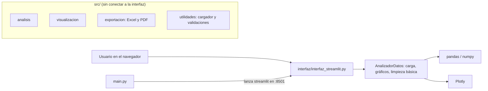

<div align="center">
  
  <h1>DataVision</h1>
  <p><b>Análisis exploratorio de datos en el navegador: sube un CSV o Excel y obtén estadísticas, correlaciones y gráficas interactivas.</b></p>
  
  
  
  
  
  <p>
    <a href="#-inicio-rápido">Inicio rápido</a> ·
    <a href="#-características">Características</a> ·
    <a href="#-arquitectura">Arquitectura</a> ·
    <a href="#-pruebas">Pruebas</a> ·
    <a href="#-lo-que-todavía-no-existe">Limitaciones</a>
  </p>
</div>

DataVision es una aplicación web local hecha con **Streamlit, pandas y Plotly** para explorar un
dataset tabular sin escribir código: carga de archivo, estadísticas descriptivas, matriz de
correlación, gráficas y limpieza básica. **No** es un servicio en la nube, no guarda datos en
ningún servidor y, hoy, es un prototipo sin tests ni CI.

## 🎬 Vista rápida

No hay capturas: la app necesita Streamlit y sus dependencias, que no se instalaron para este
README, así que preferimos no mostrar imágenes que no sean reales. Este es el flujo de uso tal
como lo implementa `interfaz/interfaz_streamlit.py`:

```text
python main.py  ->  http://localhost:8501
 |
 |- Barra lateral: subir .csv / .xlsx / .xls, o "Datos Demo", o descargar una plantilla CSV
 |- Pantalla de inicio: botón "Iniciar con datos de ejemplo" (datos/ejemplos/empleados.csv)
 `- Con datos cargados, 5 pestañas:
      Vista General | Estadísticas | Correlaciones | Gráficas | Limpieza
```

## ✨ Características

| Característica | Detalle |
|---|---|
| Carga de datos | Subida de `.csv`, `.xlsx` y `.xls`; para CSV prueba las codificaciones `utf-8`, `latin-1`, `iso-8859-1` y `cp1252`. |
| Datos de ejemplo | `datos/ejemplos/empleados.csv` y `ventas.csv`, más un dataset demo y una plantilla CSV descargable. |
| Vista general | Métricas de filas/columnas y vista previa de 5, 10, 20 o 50 filas. |
| Estadísticas | `describe()` de las columnas numéricas y, por columna, promedio, mediana, desviación estándar, mínimo, máximo y rango. |
| Correlaciones | Matriz de correlación (Pearson vía `DataFrame.corr()`) entre columnas numéricas. |
| Gráficas | Distribución, barras por columna categórica, correlación y dispersión (Plotly). Descarga en HTML; en PNG solo si instalas `kaleido`. |
| Limpieza | Eliminar duplicados y tratar nulos por columna: eliminar filas, rellenar con media, con mediana o con un valor propio. |
| Ajustes | Selector de tema de color y precisión decimal en la barra lateral. |

## 🏗️ Arquitectura

La interfaz actual es un solo archivo con la clase `AnalizadorDatos`. El paquete `src/` contiene
módulos más completos (análisis, exportación, validación) que **la interfaz todavía no importa**.



<details>
<summary>Estructura de carpetas</summary>

```text
main.py                      Punto de entrada (lanza Streamlit; --help, --version, --info, --check)
interfaz/interfaz_streamlit.py   Interfaz completa (~1400 líneas)
src/analisis/                correlaciones, estadisticas, limpieza_datos
src/visualizacion/           graficos, tablas
src/exportacion/             exportar_excel, exportar_pdf
src/utilidades/              cargador_datos (csv/excel/json/parquet/tsv), validaciones
datos/ejemplos/              empleados.csv, ventas.csv
Dockerfile, docker-compose.yml, install.bat/.sh, run.bat, check_system.py
docs/tutorial-ejecucion.md, QUICKSTART.md, CHANGELOG.md
```

</details>

## 🚀 Inicio rápido

| Requisito | Versión |
|---|---|
| Python | 3.9 o superior (lo valida `main.py`) |
| Dependencias | `requirements.txt` (streamlit, pandas, numpy, matplotlib, seaborn, plotly, openpyxl, etc.) |

1. Clona el repositorio y entra en la carpeta:
   ```bash
   git clone https://github.com/Luiss2080/DataVision.git
   cd DataVision
   ```
2. Crea un entorno virtual e instala dependencias:
   ```bash
   python -m venv .venv
   source .venv/bin/activate      # Windows: .venv\Scripts\activate
   pip install -r requirements.txt
   ```
3. Arranca la app (abre `http://localhost:8501`):
   ```bash
   python main.py
   # o directamente:
   streamlit run interfaz/interfaz_streamlit.py
   ```

> No se ejecutó la aplicación al preparar este README (Streamlit no estaba instalado): los
> comandos salen de `main.py`, `requirements.txt` y el `Dockerfile`, no de una corrida verificada.

<details>
<summary>Docker</summary>

El repo trae `Dockerfile` (Python 3.11-slim) y `docker-compose.yml` que exponen el puerto 8501:

```bash
docker compose up --build
```

El `HEALTHCHECK` usa `curl`, que la imagen `python:3.11-slim` no incluye por defecto; puede
marcar el contenedor como no saludable aunque la app funcione. No se probó.

</details>

## 🧪 Pruebas

No hay pruebas. La carpeta `tests/` solo contiene `__init__.py` y no hay flujo de CI.
`requirements.txt` lista pytest, pytest-cov, black y flake8, pero no hay nada que ejecutar.

## 🔒 Seguridad

No hay autenticación ni almacenamiento remoto: los archivos se procesan en la sesión local de
Streamlit. Si expones el puerto 8501 (p. ej. con Docker), cualquiera con acceso a la URL podrá usar
la app y subir archivos.

## 🚧 Lo que todavía no existe

- **`src/` no está conectado a la interfaz**: las exportaciones a Excel/PDF, la detección de
  outliers, las validaciones de calidad y la carga de JSON/Parquet existen como código en `src/`,
  pero la UI no las usa. La UI solo acepta CSV y Excel.
- **El selector "formato de exportación"** de la barra lateral guarda la preferencia pero no exporta
  datos; lo único descargable hoy son las gráficas (HTML/PNG) y la plantilla CSV.
- **Cifras de marketing sin medir**: la pantalla de inicio muestra "< 2 seg" y "1M+ filas" como
  texto fijo; nunca se midieron. Quedan fuera de este README.
- La descarga PNG requiere `kaleido`, que no figura en `requirements.txt`.
- Sin tests, sin CI, y `requirements.txt` mezcla dependencias de ejecución con herramientas de
  desarrollo. La versión aparece como 2.0.1 en `main.py`/`CHANGELOG.md` y como 1.0.0 en el texto de
  `--info`.

## 📄 Licencia

MIT, ver [`LICENSE`](LICENSE).

<div align="center"><sub>Hecho por Luiss2080 · Streamlit + pandas + Plotly</sub></div>
